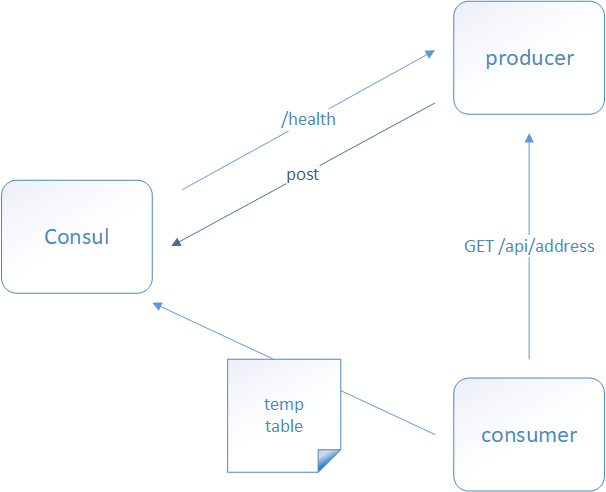

# springcloud_consul_demo
springcloud2.x使用consul作为注册中心,在服务消费方使用feign实现服务调用

#### 服务注册和发现流程

如图:

##### 

##### 流程说明:

1. 当 Producer 启动的时候，会向 Consul 发送一个 post 请求，告诉 Consul 自己的 IP 和 Port
2. Consul 接收到 Producer 的注册后,每隔10s（默认）会向 Producer 发送一个健康检查的请求,检验Producer是否健康
3. 当 Consumer 发送 GET 方式请求调用 Producer服务 时,会先从 Consul 中拿到一个存储服务 IP 和 Port 的临时表(.服务注册表),从表中拿到 Producer 的 IP 和 Port 后再发送 GET 方式请求调用具体的服务
4. 该临时表每隔10s会更新，只包含有通过了健康检查的 Producer

```shell
  # start single node as consul service:
  /usr/local/opt/consul/bin/consul agent -server -bootstrap-expect 1 -data-dir=/tmp/consul1 -ui
  
  # 
  
```

```shell
#testing curl:
curl http://127.0.0.1:8002/consumer/user/getUsersViaRpc 
curl http://127.0.0.1:8002/consumer/user/getUsersViaHttp 
curl http://127.0.0.1:8001/provider/user/getUsers
```


test: auto config introduction
https://docs.spring.io/spring-boot/docs/current/reference/html/test-auto-configuration.html